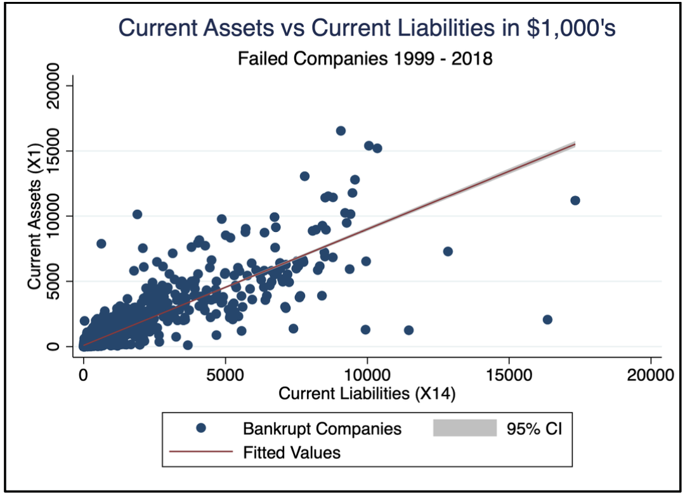
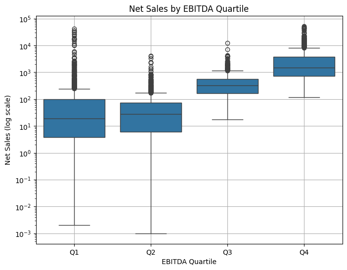
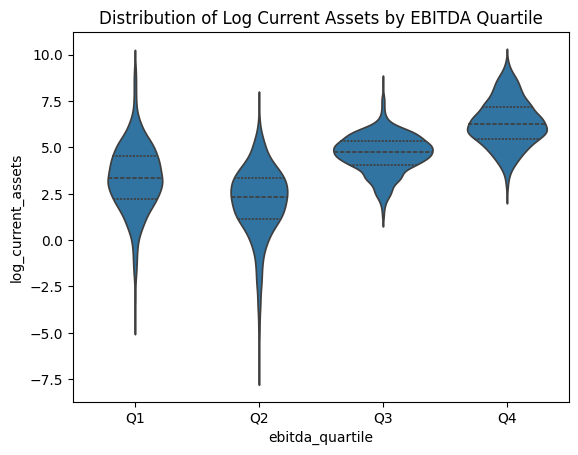
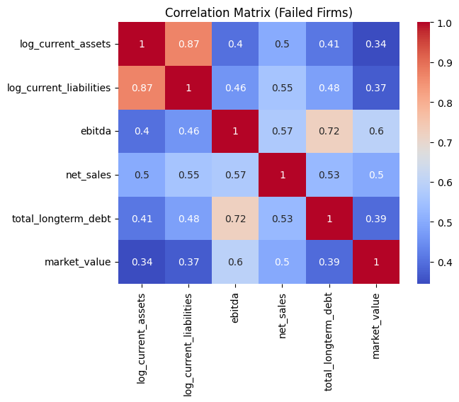
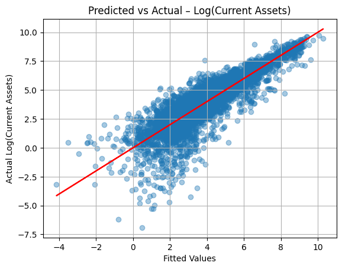

# Bankruptcy Prediction Based on Financial Indicators of Domestic Companies (1999–2018)

## 1. Project Overview
This project investigates whether higher current liabilities are associated with lower current assets in bankrupt U.S. public companies, using panel data from 1999 to 2018. The analysis focuses exclusively on failed firms listed on NYSE and NASDAQ to explore how liability pressure may precede insolvency. Stata was used for econometric modeling, SQL for data cleaning, and Jupyter Notebook for visualization.

## 2. Goals and Objectives
- **Primary Goal**: Evaluate how current liabilities impact current assets among failed companies.
- **Secondary Goal**: Control for other financial indicators (e.g., EBITDA, net sales) to reduce omitted variable bias and uncover deeper relationships.

## 3. Data Sources and Features
**Source**: Panel dataset of 8,262 U.S. public companies (1999–2018)  
**Filtered Sample**: 5,219 observations across 609 failed companies

**Key Variables**:
- `current_assets` (`X1`)
- `current_liabilities` (`X14`)
- `ebitda` (`X4`)
- `market_value` (`X8`)
- `net_sales` (`X9`)
- `total_longterm_debt` (`X11`)

Engineered features:
- `log_current_assets`, `log_current_liabilities`
- `current_liabilities_squared`
- `liab_market_interaction`

## 4. Data Cleaning and Engineering
- Filtered to include only failed firms (`status_label == 0`)
- Removed missing values in critical variables
- Created squared and log-transformed variables
- Built interaction terms for better model interpretability
- Normalized units for consistency and interpretability

## 5. Modeling and Analysis
### Regression Specifications:
- **Simple Linear**  
  `current_assets ~ current_liabilities`  
  Coefficient: 0.471, Adj. R²: 0.320

- **Log-Log**  
  `log(current_assets) ~ log(current_liabilities)`  
  Coefficient: 0.519, Adj. R²: 0.288

- **Quadratic**  
  `current_assets ~ current_liabilities + current_liabilities²`  
  Adj. R²: 0.338

- **Interaction**  
  `current_assets ~ current_liabilities * market_value`  
  Adj. R²: 0.402

- **Full Model with Controls**  
  Includes `ebitda`, `net_sales`, `total_longterm_debt`  
  Adj. R²: 0.603

## 6. Key Insights
- Current liabilities and assets are positively correlated, but **assets grow slower** than liabilities.
- A **coefficient < 1** in the log-log model implies shrinking liquidity under debt pressure.
- **Net sales and long-term debt** are stronger predictors of assets than EBITDA.
- **Diminishing returns** to liabilities are visible through the quadratic specification.
- **Interaction with market value** adds nuance by capturing company scale.

## 7. Key Visualizations
- Scatterplot: `current_liabilities` vs `current_assets`
- 
- Boxplot of Net Sales by EBITDA Quartile
- 
- Violin Plot of `log_current_assets` by `ebitda` quartile
- 
- Heatmap of correlations between financial indicators
- 
- Predicted vs Actual Plot from OLS regression
- 
- 3D surface plot: `log_current_liabilities`, `market_value`, and `log_current_assets`
- 

## 8. Key Findings and Stakeholder Takeaways

- **Asset Growth Slower Than Liability Growth**  
  Across all models, current assets increase with rising current liabilities but at a **less than proportional rate**. This imbalance may push companies toward a **current ratio below 1**, a common red flag for financial distress or pending bankruptcy.

- **Strong Correlation Between Financial Indicators**  
  Net sales and long-term debt are **statistically significant predictors** of asset levels, while EBITDA has limited explanatory power in this context. This suggests revenue and debt obligations are more closely tied to solvency.

- **Significance of Market Value Interaction is Limited**  
  Market value shows **minimal direct influence** on current assets, but its interaction with current liabilities does have a marginal effect—indicating **firm size alone isn’t a strong predictor** unless considered alongside liabilities.

- **3D Surface Plot Reveals Structural Patterns**  
  The regression surface plot reveals a **plane-like relationship** between log liabilities, market value, and log current assets, reinforcing the additive nature of financial pressure on asset reporting.

- **Visualizations Validate Regression Findings**  
  All plots—scatter, violin, and heatmaps—visually reinforce the **underlying regression logic**, confirming the stability and direction of the estimated coefficients.

---

## 9. Actionable Recommendations

- **Monitor Current Ratio and Liability Growth**  
  Firms should regularly track their current ratio and ensure liabilities are not growing faster than assets, especially in industries with high operational volatility.

- **Enhance Reporting on Net Sales and Long-Term Debt**  
  As these two metrics are key predictors of asset size, **more granular and real-time reporting** can improve internal forecasting and creditor confidence.

- **Deprioritize EBITDA in Short-Term Solvency Analysis**  
  EBITDA’s weak predictive power in this context suggests it may be less useful for **short-term liquidity assessments**, and firms should avoid over-relying on it for bankruptcy risk evaluations.

- **Use Visual Diagnostics in Financial Auditing**  
  Incorporate plots like fitted-vs-actual and 3D regression surfaces into regular **internal risk reviews** to visually flag deteriorating asset-liability dynamics.

- **Test for Broader Macroeconomic or Sectoral Controls**  
  Consider expanding models with macro indicators and industry fixed effects to capture **external shocks** that may distort liability-to-asset dynamics (e.g., inflation, interest rate hikes, sector downturns).

---

## 10. Challenges and Limitations
- No comparison with **non-bankrupt firms**, limiting generalizability
- Missing macroeconomic variables (e.g., interest rate, inflation)
- No **industry fixed effects** or time-specific shocks
- Results may suffer from **endogeneity** (reverse causality)
- **EBITDA** shows minimal predictive power, possibly due to noise or inconsistencies in reporting

## 11. Future Directions
- Add **control group of alive firms** for contrast
- Explore **machine learning models** for prediction (e.g., XGBoost, Logistic Regression)
- Include **industry/time fixed effects** and macro indicators
- Model **bankruptcy as an outcome** using classification techniques
- Augment with **textual data** (e.g., financial filings or sentiment) for hybrid modeling
