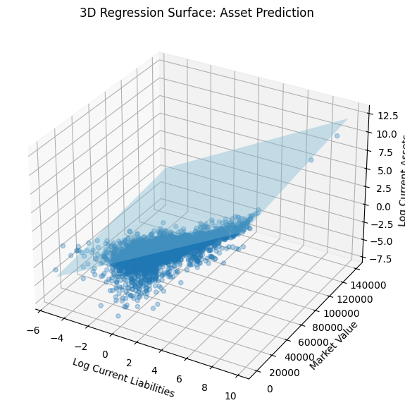

# Bankruptcy Prediction Based on Financial Indicators of Domestic Companies (1999–2018)

## 1. Project Overview
This project investigates whether higher current liabilities are associated with lower current assets in bankrupt U.S. public companies, using panel data from 1999 to 2018. The analysis focuses exclusively on failed firms listed on NYSE and NASDAQ to explore how liability pressure may precede insolvency. Stata was used for econometric modeling, SQL for data cleaning, and Jupyter Notebook for visualization.

## 2. Goals and Objectives
- **Primary Goal**: Evaluate how current liabilities impact current assets among failed companies.
- **Secondary Goal**: Control for other financial indicators (e.g., EBITDA, net sales) to reduce omitted variable bias and uncover deeper relationships.

## 3. Data Sources and Features
**Source**: Panel dataset of 8,262 U.S. public companies (1999–2018)  
**Filtered Sample**: 5,219 observations across 609 failed companies

**Key Variables**:
- `current_assets` (`X1`)
- `current_liabilities` (`X14`)
- `ebitda` (`X4`)
- `market_value` (`X8`)
- `net_sales` (`X9`)
- `total_longterm_debt` (`X11`)

Engineered features:
- `log_current_assets`, `log_current_liabilities`
- `current_liabilities_squared`
- `liab_market_interaction`

## 4. Data Cleaning and Engineering
- Filtered to include only failed firms (`status_label == 0`)
- Removed missing values in critical variables
- Created squared and log-transformed variables
- Built interaction terms for better model interpretability
- Normalized units for consistency and interpretability

## 5. Modeling and Analysis
### Regression Specifications:
- **Simple Linear**  
  `current_assets ~ current_liabilities`  
  Coefficient: 0.471, Adj. R²: 0.320

- **Log-Log**  
  `log(current_assets) ~ log(current_liabilities)`  
  Coefficient: 0.519, Adj. R²: 0.288

- **Quadratic**  
  `current_assets ~ current_liabilities + current_liabilities²`  
  Adj. R²: 0.338

- **Interaction**  
  `current_assets ~ current_liabilities * market_value`  
  Adj. R²: 0.402

- **Full Model with Controls**  
  Includes `ebitda`, `net_sales`, `total_longterm_debt`  
  Adj. R²: 0.603

## 6. Key Insights
- Current liabilities and assets are positively correlated, but **assets grow slower** than liabilities.
- A **coefficient < 1** in the log-log model implies shrinking liquidity under debt pressure.
- **Net sales and long-term debt** are stronger predictors of assets than EBITDA.
- **Diminishing returns** to liabilities are visible through the quadratic specification.
- **Interaction with market value** adds nuance by capturing company scale.

## 7. Key Visualizations
- Scatterplot: `current_liabilities` vs `current_assets`
- 
- Boxplot of Net Sales by EBITDA Quartile
- 
- Log-Log Regression Plot
- 
- Quadratic Curve of Liabilities and Assets
- 
- Violin Plot of `log_current_assets` by `ebitda` quartile
- 
- Heatmap of correlations between financial indicators
- 
- Predicted vs Actual Plot from OLS regression
- 
- 3D surface plot: `log_current_liabilities`, `market_value`, and `log_current_assets`
- 

## 8. Challenges and Limitations
- No comparison with **non-bankrupt firms**, limiting generalizability
- Missing macroeconomic variables (e.g., interest rate, inflation)
- No **industry fixed effects** or time-specific shocks
- Results may suffer from **endogeneity** (reverse causality)
- **EBITDA** shows minimal predictive power, possibly due to noise or inconsistencies in reporting

## 9. Future Directions
- Add **control group of alive firms** for contrast
- Explore **machine learning models** for prediction (e.g., XGBoost, Logistic Regression)
- Include **industry/time fixed effects** and macro indicators
- Model **bankruptcy as an outcome** using classification techniques
- Augment with **textual data** (e.g., financial filings or sentiment) for hybrid modeling
